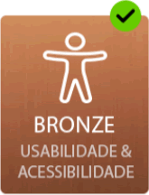
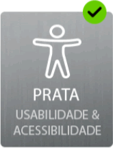
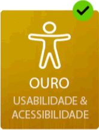

# Especificações do Selo de Usabilidade e Acessibilidade

**Mecanismo de Atribuição:** por candidatura
Período de Atribuição: 12 meses
Se o site sofrer uma alteração profunda o selo é revogado

**Método de aplicação:** imagem colocada no site com selo atribuído mas ligada ao site do selo. Imagem é alterada para versão anulada automaticamente quando o selo caduca. Clicando no selo é-se direccionado para o site do selo onde se comprova a sua autenticidade. A entidade tem completa liberdade para afixar o selo de Usabilidade/Acessibilidade na página e na posição que considerar mais adequado. Sendo a Declaração de Acessibilidade obrigatória para todas as entidades e sendo esta um depósito público dos esforços levados a efeito pelas entidades, o selo deve fazer parte da mesma.

## Níveis de classificação

Estão estruturados 3 níveis, os quais correspondem a 3 níveis de esforço distintos. A cada um dos níveis corresponde um tipo de selo. Para o nível 1, o mais básico, o selo bronze; para o nível o selo prata; e para o nível 3, o mais exigente em termos de esforço, o selo ouro.

### Nível 1 (Bronze)

A entidade tem de cumprir com as heurísticas constantes da [lista "Conteúdo"](#lista-bronze) (nível de cumprimento: 75% no primeiro ano) e os conteúdos têm de passar a bateria de testes de um validador de acessibilidade Web para o 'AA' das WCAG 2.1 de acordo com a metodologia referida no artigo 9º, n.º 1, alínea a) do DL n.º 83/2018, de 19 de outubro.

### Nível 2 (Prata)

Cumulativamente ao que é exigido para o nível 1 a entidade tem de cumprir com as heurísticas constantes da [lista "Transação"](#lista-prata) e da (lista "10 aspectos críticos de acessibilidade funcional")[#lista-verificacao] (nível de cumprimento: 75% no primeiro ano).

### Nível 3 (Ouro)

Cumulativamente ao que é exigido para o nível 2, a entidade tem de levar a efeito Testes com Utilizadores.

## Listas de Verificação

### Bronze

- [Lista de verificação de Usabilidade para sítios Web: Conteúdos](lista-bronze.md){: #lista-bronze}

### Prata

- [Lista de verificação de Usabilidade para sítios Web: Transação](lista-prata.md){: #lista-prata}
- [Lista de verificação de Acessibilidade para sítios Web: 10 aspetos críticos a ter em conta](lista-verificacao.md){: #lista-verificacao}

